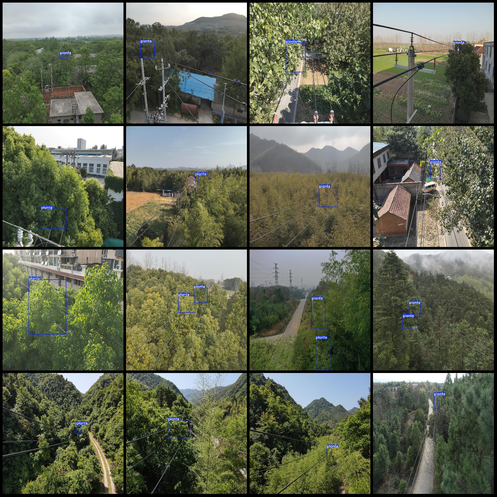
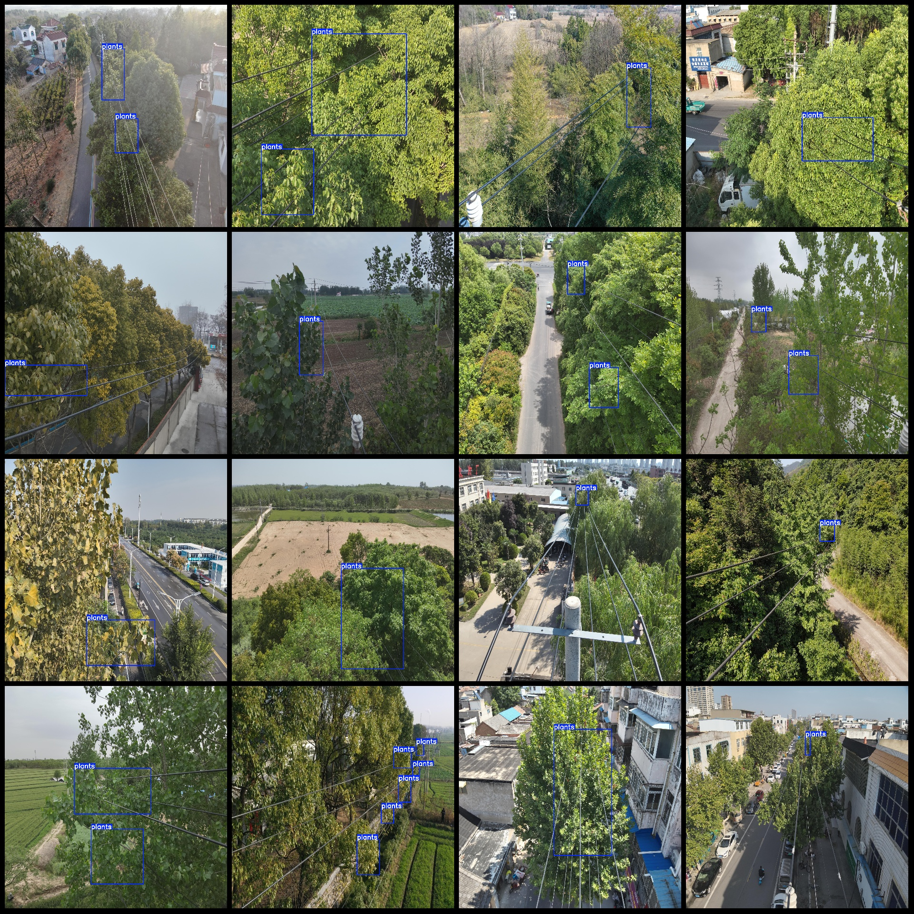

# High-Resolution Power Scenery Vegetation Overgrowth Detection Dataset VOC+YOLO with 447 Categories

The dataset format is: Pascal VOC format + YOLO format (the txt files do not contain the split paths, but only contain the jpg images and the corresponding VOC format xml files and yolo format txt files).
number of images: 447  
annotation count: 447  
annotation count: 447  
annotationnumber of classes: 1  
annotation class names:["plants"]  
boxes per class:   
plants box count = 555  
total boxes: 555  
image resolution: 2048x2048  
Use the annotation tool: labelImg
Annotation rules: draw a rectangle around the class
Important notes: There are no special statements.
Special statement: This dataset does not guarantee the accuracy of the trained model or weight files.
Image preview:
## Images

Here is a pay link on Stripe ( https://buy.stripe.com/3cs8yP7sY87d0vu9AB ). Please contact me lonlonago@foxmail.com after funding $89, and I will send you a complete data files , thank you!

